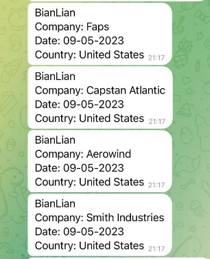
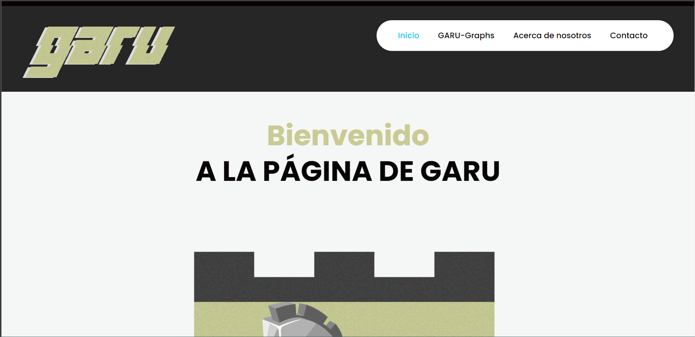
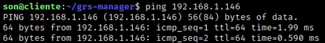
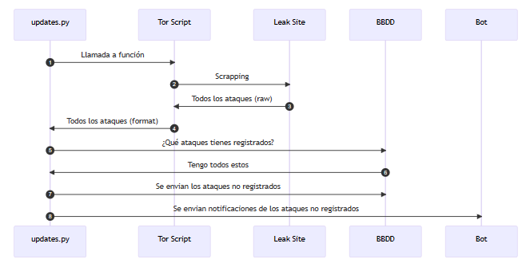

# 🦊 GARU — Ransomware Threat Intelligence Platform

> Plataforma profesional de threat intelligence para ransomware basada en scraping en la red Tor.

---

## 🚨 Problemática

El ransomware se ha convertido en una de las principales amenazas globales, con ataques que impactan:

- Operaciones empresariales
- Integridad de datos
- Costes financieros elevados

Sin embargo, gran parte de la información relevante:

- Está fragmentada
- Se encuentra en la dark web (Tor leak sites)
- No es fácilmente explotable para análisis

---

## 💡 Solución

GARU (Guineueta Anti Ransom Unit) centraliza todo el ciclo de inteligencia:

Recolección → Normalización → Almacenamiento → Análisis → Visualización

El sistema permite:

- Detectar nuevos ataques automáticamente
- Analizar tendencias por país, banda y fecha
- Generar dashboards dinámicos
- Recibir alertas en tiempo real

---

## 🧠 Features

- 🔍 Scraping automatizado de leak sites en Tor
- ⏱️ Monitorización periódica (cron jobs)
- 🗃️ Base de datos NoSQL optimizada (MongoDB)
- 🖥️ CLI para análisis avanzado y reporting
- 📊 Dashboard web interactivo (gráficas dinámas)
- 🔔 Alertas en Telegram en tiempo real
- 🐳 Infraestructura completamente dockerizada

---

## 🏗️ Arquitectura

```
               ┌────────────────────────────┐
                │        TOR NETWORK         │
                │   (Leak Sites scraping)   │
                └────────────┬──────────────┘
                             │
                     [Tor Scripts - Python]
                             │
                             ▼
                ┌────────────────────────────┐
                │        GRS SERVICE         │
                │  - Data processing         │
                │  - Normalization           │
                │  - Alert system            │
                └────────────┬──────────────┘
                             │
                             ▼
                ┌────────────────────────────┐
                │        MongoDB             │
                │  Collection: bandas        │
                └────────────┬──────────────┘
                             │
        ┌────────────────────┼────────────────────┐
        ▼                    ▼                    ▼
   CLI Manager         Web Dashboard        Telegram Bot
   (Python)            (PHP/JS)             (Alerts)
```

---

## ⚙️ Stack

- Python
- MongoDB
- Docker
- PHP / JS
- Telegram API

---

## 🚀 Instalación

```bash
git clone https://github.com/TaimourM03/ANTI-RANSOMWARE-UNIT.git
cd ANTI-RANSOMWARE-UNIT
docker-compose up -d
```

---

## 🌐 Servicios

- Web: http://localhost:20000
- Mongo: http://localhost:8081

---

## 📊 Uso

```bash
python3 main.py
```

---

## 🔔 Alertas

Notificaciones en tiempo real vía Telegram.

---

## 📈 Roadmap

- API REST
- ML detección ransomware
- UI moderna

## 📸 Demo

### 🌐 Dashboard Web


### 📊 Generación de gráficas


### 🖥️ CLI de análisis


### 🗃️ MongoDB UI


---

⭐ Valor diferencial

GARU no es solo un scraper:

→ Es una plataforma completa de threat intelligence
→ Automatiza el ciclo completo de análisis
→ Está preparada para escalar y evolucionar
